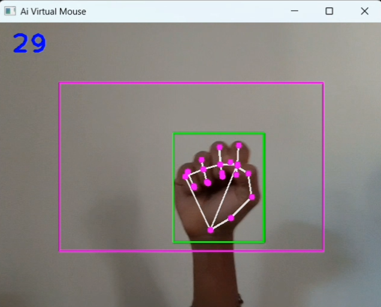

# AI-Virtual-Mouse-OpenCV
A computer vision-based virtual mouse that enables users to control the system cursor using real-time hand gestures. Built with Python, OpenCV, and MediaPipe for touchless human-computer interaction.


---

## 📌 Overview

The AI Virtual Mouse is a real-time computer vision application that detects hand landmarks using **MediaPipe** and processes them with **OpenCV** to control the system mouse. The project recognizes finger positions and hand gestures to perform various mouse operations such as cursor movement and clicking.

This project demonstrates the practical application of **Computer Vision**, **Human-Computer Interaction (HCI)**, and **Gesture Recognition**.

---

## ✨ Features

- 🖐️ Real-time hand detection
- 🎯 Accurate hand landmark tracking
- 🖱️ Move mouse cursor using index finger
- 👆 Left-click using finger gesture
- ⚡ Real-time performance (FPS Display)
- 🎥 Webcam-based interaction
- 💻 Works without any external hardware

---

## 🛠️ Technologies Used

| Technology | Purpose |
|------------|---------|
| Python | Programming Language |
| OpenCV | Image Processing & Webcam |
| MediaPipe | Hand Landmark Detection |
| AutoPy | Mouse Control |
| NumPy | Numerical Computation |

---

## 📂 Project Structure

```
AI-Virtual-Mouse-OpenCV/
│
├── AiVirtualMouseProject.py      # Main application
├── HandTrackingModule.py         # Hand detection module
├── README.md
├── .gitignore
└── assets
```

---

## 📖 How It Works

1. Captures live video from the webcam.
2. Detects the user's hand using MediaPipe.
3. Identifies 21 hand landmarks.
4. Tracks the index finger position.
5. Maps camera coordinates to screen coordinates.
6. Moves the system mouse accordingly.
7. Detects specific finger gestures to perform mouse clicks.

---

## ✋ Hand Gestures

| Gesture | Action |
|----------|--------|
| Index Finger Up | Move Cursor |
| Index + Middle Finger Up | Clicking Mode |
| Fingers Close Together | Left Click |

---

## 📷 Demo




---

## 💡 Applications

- Touchless Human-Computer Interaction
- Smart Workstations
- Accessibility Tools
- Gesture-Controlled Systems
- Computer Vision Learning
- AI-Based Automation

---

## 👨‍💻 Author

**Meet Korat**
