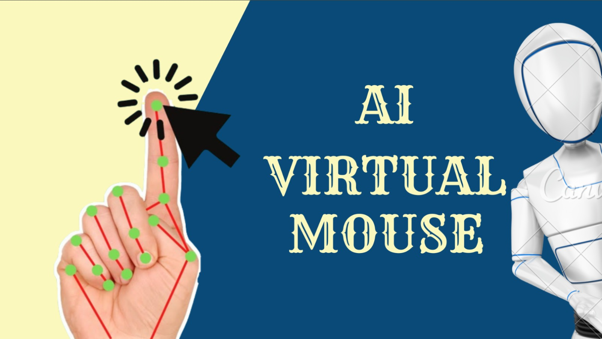

# AI-Virtual-Mouse-OpenCV
A computer vision-based virtual mouse that enables users to control the system cursor using real-time hand gestures. Built with Python, OpenCV, and MediaPipe for touchless human-computer interaction.

